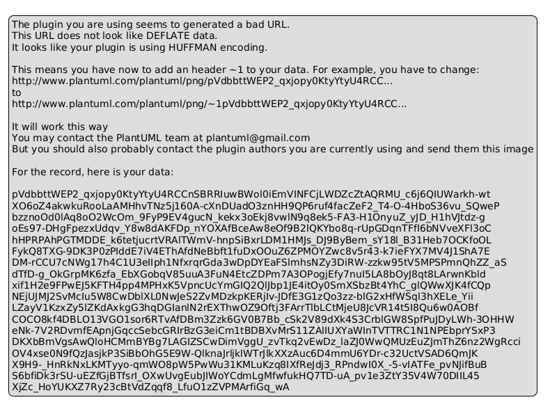

# 💰 Payment Transactions System

Полнофункциональная информационная система для управления платежными транзакциями с современным веб-интерфейсом, аналитикой и визуализацией данных.

## 🚀 Возможности

### Основной функционал
- ✅ **Управление транзакциями** - Полный CRUD для платежных операций
- 📊 **Аналитика и статистика** - Интерактивные графики и диаграммы
- 🏷️ **Категории платежей** - Гибкая система категоризации
- 👥 **Управление пользователями** - Админ-панель с полным контролем
- 🔐 **Аутентификация** - Безопасная система входа и регистрации
- 📈 **Визуализация данных** - Графики доходов, расходов, трендов

### Технический стек

#### Backend
- **FastAPI** 0.104.1 - Современный веб-фреймворк
- **SQLite** - Встроенная база данных
- **Pydantic** - Валидация данных
- **Uvicorn** - ASGI сервер

#### Frontend
- **React** 18.2 - UI библиотека
- **Vite** 5.0 - Быстрый сборщик
- **Material-UI** - Компоненты интерфейса
- **Recharts** - Библиотека графиков
- **Framer Motion** - Плавные анимации
- **React Router** - Маршрутизация
- **Axios** - HTTP клиент

## 📦 Установка и запуск

## 📐 UML диаграммы

### Use Case диаграмма

Диаграмма вариантов использования показывает взаимодействие пользователей с системой:



**Просмотреть диаграмму:**
- [PlantUML исходник](./docs/use-case-diagram.puml)
- [Документация диаграмм](./docs/README.md)

**Акторы:**
- 👤 **Пользователь** - 20 use cases (аутентификация, транзакции, аналитика, категории)
- 👨‍💼 **Администратор** - все права пользователя + 7 административных функций

**Online просмотр:** [Открыть в PlantUML Editor](http://www.plantuml.com/plantuml/uml/)

---

## 📦 Установка и запуск

### Предварительные требования
- Python 3.8+ (рекомендуется 3.11 или 3.14+)
- Node.js 16+
- npm или yarn

> **Важно для Python 3.14+**: Используйте специальный скрипт `start_backend_py314.bat` или обновленный `requirements.txt`

### Быстрый старт

#### Вариант 1: Автоматический запуск (рекомендуется)

**Windows:**
```bash
# Запуск Backend
cd backend
start_backend.bat

# Для Python 3.14+ используйте:
start_backend_py314.bat

# Запуск Frontend (в новом терминале)
cd frontend
start_frontend.bat
```

**Linux/Mac:**
```bash
# Запуск Backend
cd backend
chmod +x start_backend.sh
./start_backend.sh

# Запуск Frontend (в новом терминале)
cd frontend
chmod +x start_frontend.sh
./start_frontend.sh
```

#### Вариант 2: Ручная установка

**Backend:**
```bash
cd backend
pip install -r requirements.txt
python main.py
```

**Frontend:**
```bash
cd frontend
npm install
npm run dev
```

### Доступ к приложению

После запуска:
- **Frontend:** http://localhost:5173
- **Backend API:** http://localhost:8000
- **API Documentation:** http://localhost:8000/docs

### Тестовые учетные данные

**Администратор:**
- Логин: `admin`
- Пароль: `admin123`

## 📚 Структура проекта

```
payment_transactions/
│
├── backend/
│   ├── routes/
│   │   ├── auth.py              # Аутентификация
│   │   ├── admin.py             # Администрирование
│   │   ├── transactions.py      # Транзакции
│   │   └── analytics.py         # Аналитика
│   ├── database.py              # Управление БД
│   ├── models.py                # Pydantic модели
│   ├── main.py                  # FastAPI приложение
│   └── requirements.txt         # Зависимости
│
├── frontend/
│   ├── src/
│   │   ├── components/
│   │   │   └── layout/          # Layout компоненты
│   │   ├── pages/               # Страницы приложения
│   │   ├── services/
│   │   │   └── api.js           # API клиент
│   │   ├── context/
│   │   │   └── AuthContext.jsx # Контекст аутентификации
│   │   ├── App.jsx              # Главный компонент
│   │   └── main.jsx             # Точка входа
│   ├── package.json             # Зависимости
│   └── vite.config.js           # Конфигурация Vite
│
└── database.db                  # SQLite база данных
```

## 🎯 Основные функции

### 1. Дашборд
- Общая статистика (баланс, доходы, расходы)
- Графики динамики по месяцам
- Распределение по статусам
- Расходы по категориям
- Последние транзакции

### 2. Транзакции
- Создание новых транзакций
- Редактирование существующих
- Удаление транзакций
- Фильтрация по типу, статусу, категории
- Поддержка трех типов: доход, расход, перевод
- Статусы: в обработке, завершено, ошибка, отменено

### 3. Аналитика
- Графики динамики доходов/расходов
- Распределение по категориям (pie chart)
- Ежедневная динамика
- Топ-10 категорий расходов
- Настраиваемые периоды

### 4. Категории
- Управление категориями платежей
- Настройка цвета и иконки
- Описание категорий
- CRUD операции

### 5. Администрирование (только для admin)
- Управление пользователями
- Статистика системы
- Изменение ролей и статусов
- Удаление пользователей

## 🔌 API Endpoints

### Аутентификация
- `POST /api/auth/register` - Регистрация
- `POST /api/auth/login` - Вход
- `POST /api/auth/logout` - Выход
- `GET /api/auth/me` - Текущий пользователь

### Транзакции
- `GET /api/transactions/` - Список транзакций
- `POST /api/transactions/` - Создать транзакцию
- `GET /api/transactions/{id}` - Получить транзакцию
- `PUT /api/transactions/{id}` - Обновить транзакцию
- `DELETE /api/transactions/{id}` - Удалить транзакцию
- `GET /api/transactions/{id}/history` - История изменений

### Категории
- `GET /api/transactions/categories` - Список категорий
- `POST /api/transactions/categories` - Создать категорию
- `PUT /api/transactions/categories/{id}` - Обновить категорию
- `DELETE /api/transactions/categories/{id}` - Удалить категорию

### Аналитика
- `GET /api/analytics/stats` - Общая статистика
- `GET /api/analytics/chart/monthly` - Месячная динамика
- `GET /api/analytics/chart/category` - По категориям
- `GET /api/analytics/chart/status` - По статусам
- `GET /api/analytics/chart/daily` - Ежедневная динамика
- `GET /api/analytics/top-categories` - Топ категории
- `GET /api/analytics/recent-activity` - Последние транзакции

### Администрирование
- `GET /api/admin/users` - Список пользователей
- `PUT /api/admin/users/{id}` - Обновить пользователя
- `DELETE /api/admin/users/{id}` - Удалить пользователя
- `GET /api/admin/stats` - Статистика пользователей

## 🛠️ Разработка

### Backend разработка
```bash
cd backend
# Активировать виртуальное окружение (опционально)
python -m venv venv
source venv/bin/activate  # Linux/Mac
venv\Scripts\activate     # Windows

# Установить зависимости
pip install -r requirements.txt

# Запустить в режиме разработки
python main.py
```

### Frontend разработка
```bash
cd frontend
npm install
npm run dev
```

### Сборка для продакшена
```bash
cd frontend
npm run build
```

## 🎨 Особенности дизайна

- Современный Material Design интерфейс
- Адаптивный дизайн для всех устройств
- Плавные анимации (Framer Motion)
- Интерактивные графики (Recharts)
- Цветовое кодирование данных
- Toast уведомления

## 🔐 Безопасность

⚠️ **Важно:** Данная система создана для демонстрационных целей и использует упрощенную аутентификацию:
- Пароли хранятся в открытом виде (plain text)
- Простая сессионная аутентификация через cookies
- Для production использования требуется:
  - Хеширование паролей (bcrypt)
  - JWT токены
  - HTTPS
  - Rate limiting
  - CSRF защита

## 📝 База данных

Система автоматически создает SQLite базу данных со следующими таблицами:

1. **users** - Пользователи системы
2. **sessions** - Активные сессии
3. **payment_categories** - Категории платежей
4. **transactions** - Платежные транзакции
5. **transaction_history** - История изменений

При первом запуске создается:
- Администратор по умолчанию (admin/admin123)
- 10 стандартных категорий платежей

## 🚀 Production Deployment

### Быстрый деплой на Render + Netlify

Проект готов к деплою на **Render** (backend) и **Netlify** (frontend) из коробки!

📖 **[Полный гайд по деплою](./DEPLOYMENT_GUIDE.md)** - Подробное пошаговое руководство

⚡ **[Быстрый деплой за 5 минут](./QUICK_DEPLOY.md)** - Краткая инструкция

#### Что уже настроено:

✅ `render.yaml` - Конфигурация для Render
✅ `backend/start.sh` - Скрипт запуска backend
✅ `frontend/netlify.toml` - Конфигурация для Netlify
✅ Environment variables - Примеры в `.env.example`
✅ CORS - Динамическая настройка для production
✅ API URL - Конфигурируется через env переменные

#### Деплой за 3 шага:

1. **Backend на Render:**
   - Зарегистрируйтесь на [render.com](https://render.com)
   - Создайте Web Service из GitHub репозитория
   - Укажите `backend` как Root Directory

2. **Frontend на Netlify:**
   - Зарегистрируйтесь на [netlify.com](https://netlify.com)
   - Импортируйте проект из GitHub
   - Укажите `frontend` как Base Directory
   - Добавьте `VITE_API_BASE_URL` с вашим Render URL

3. **Настройте CORS:**
   - В Render добавьте `CORS_ORIGINS` с вашим Netlify URL
   - Готово! 🎉

См. [DEPLOYMENT_GUIDE.md](./DEPLOYMENT_GUIDE.md) для подробных инструкций

## 📄 Лицензия

MIT License - свободное использование

## 👨‍💻 Автор

Создано с помощью Claude Code

---

**Версия:** 1.0.0
**Дата:** 2025
**Статус:** Production Ready ✅
